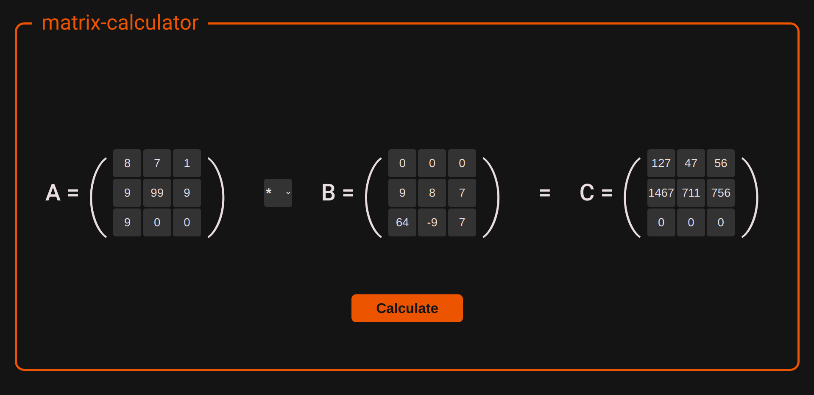

# Matrix-calculator

### Description:
    -   calculator can add, subtract or multiply two 3*3 matrices.
    -   used technologies: PHP, HTML, CSS
### How to run:
    -   ran index.php on any php server
